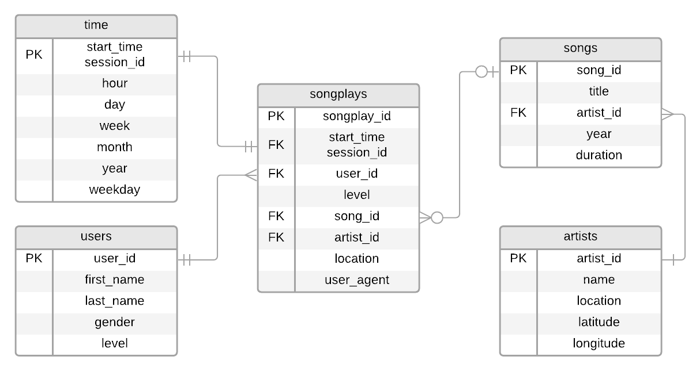

# Sparkify Songplays Data Warehouse

This is an educational data engineering project to learn about data warehouses and Amazon Redshift.

Note: Sparkify is a fictitious music streaming company.

## Motivation

In order to understand what our users are listening to, we have created the Sparkify data warehouse, which will allow us to better analyze our customers' activity. With this data warehouse, we will be able to answer questions such as:

- What are the most popular songs?
- What are the most popular artists overall?
- What are the most popular artists at a given time of the day?
- What artists and songs do specific users prefer?
- At what time does our service have the most and the least active users?

## Data Warehouse Design

This data warehouse is hoted in AWS Redshift and follows a star schema, with a central "Facts" table and several "Dimension" tables that extend the central table's information. Since the information we're most interested about regards the songs played by our users, the "Facts" table is the one that registers the instances of users playing specific songs. The "Dimension" tables that extend the information condensed in the central table are those bearing records about the users, the songs, the artists, and the moment in time at which the songs were played.

The corresponding entity-relationship diagram is:




## Reposiroty Files

This repository is comprised of the following files:

- `create_iam_role.py`: script that creates am IAM role so that the Redshift cluster can read data from S3.
- `create_warehouse.py`: script that creates the Redshift cluster.
- `create_tables.py`: script that drops the tables if they already exist and creates new empty tables according to the creation schema in `sql_queries.py`.
- `etl.py`: script that executes the ETL procedure and populates the data warehouse.
- `sql_queries.py`: module that contains all the queries used to drop, create, load, and insert records into the data warehouse.
- `query_examples.ipynb`: notebook used to execute the necessary scripts and run some illustrative queries against the data warehouse.

## ETL Pipeline

The ETL pipeline consists of the following procedures:

### Extracting data from S3

The data is extracted from S3 and loaded into staging tables in Redshift using the `copy_table_queries` in `sql_queries.py`.

### Transforming the data and populating the final tables

The staging tables are queried in such a way that the data is appropriately transformed and the result of these queries are inserted into the final analytical tables following the star schema. This is done through the `insert_table_queries` in `sql_queries.py`.

## How to Create the Data Warehose

To create and use the data warehouse, follow these steps:

1. Fill the `KEY` and `SECRET` fields of the configuration file `dwh.cfg` with the Acess Key ID and the Secret Access Key corresponding to your AWS user and save the file.
2. Run the `create_iam_role.py` Python script if the IAM role for the Redshift cluster hasn't been already created. If the IAM role is created this way, the script will print the Amazon Resourse Name (ARN) of the role.
3. Fill the `ARN` field in the configuration file with the Amazon Resourse Name (ARN) of the IAM role for the Redshift cluster and save the file.
4. Run the `create_warehouse.py` Python script.
5. Wait until the Redshift cluster appears as "available" in the AWS Console.
6. Run the `get_endpoint.py` Python script to get the cluster's endpoint address.
7. Fill the `ENDPOINT` field in the configuration file with the endpoint address obtained in the previous step and save the file.
8. Run the `create_tables.py` Python script.
9. Run the `etl.py` Python script (this step could take several minutes).
10. Run the desired queries against the data warehouse.

## Query Examples

Thanks to this data warehouse, we could, for instance, answer the question: how many songs, in average, are listened to per session?

To do so, we can run the following query:

```sql
SELECT AVG(countBySession.count) FROM
    (SELECT session_id, COUNT(songplay_id) FROM songplays
    GROUP BY session_id) AS countBySession;
```

After getting the results of this query, we could confirm that the average number of songs played per session is about nine.

We could also answer the questions: what are the five most popular songs in Sparkify?

This is done through the following query:

```sql
SELECT so.song_id, a.name AS artist_name, so.title AS song, COUNT(sp.songplay_id) AS songplay_count
FROM songplays sp
JOIN songs so ON so.song_id = sp.song_id
JOIN artists a ON a.artist_id = sp.artist_id
GROUP BY so.song_id, a.name, so.title
ORDER BY songplay_count DESC
LIMIT 5;
```

After running this query we get the five most listened to songs, where we can see the the most popular song is "You're The One" by Dwight Yoakam.
